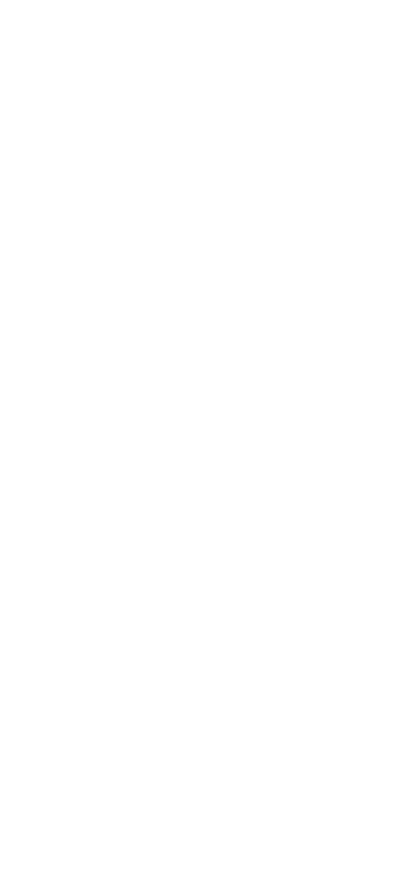
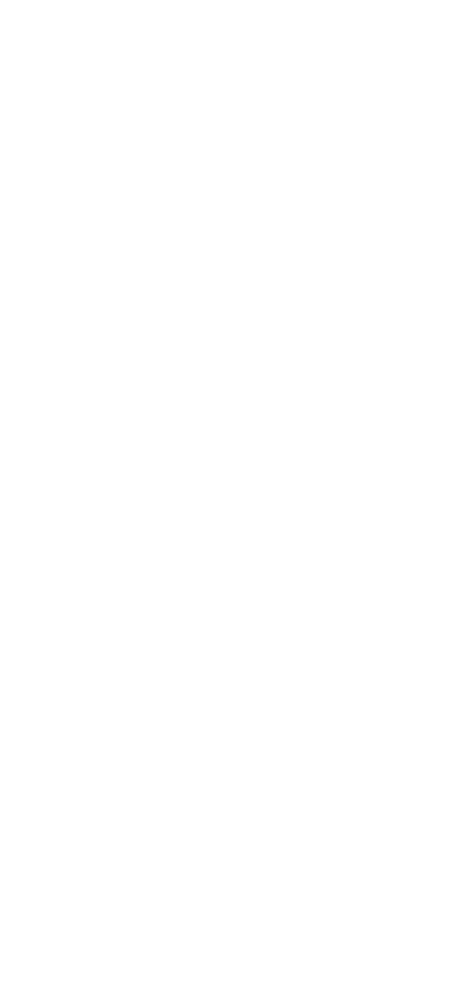
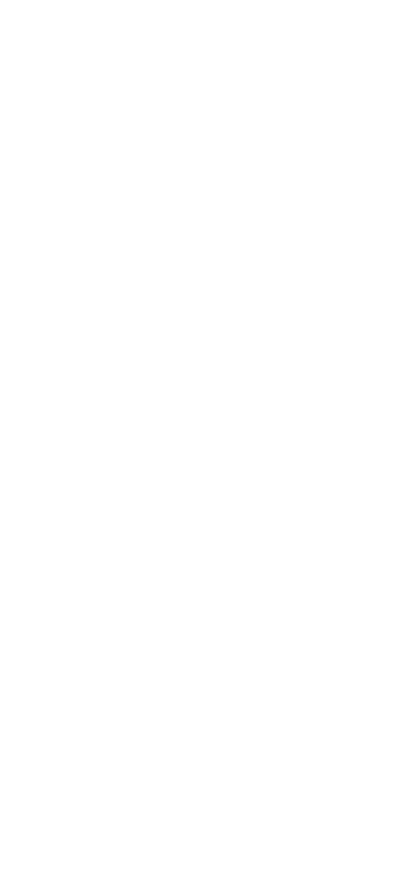
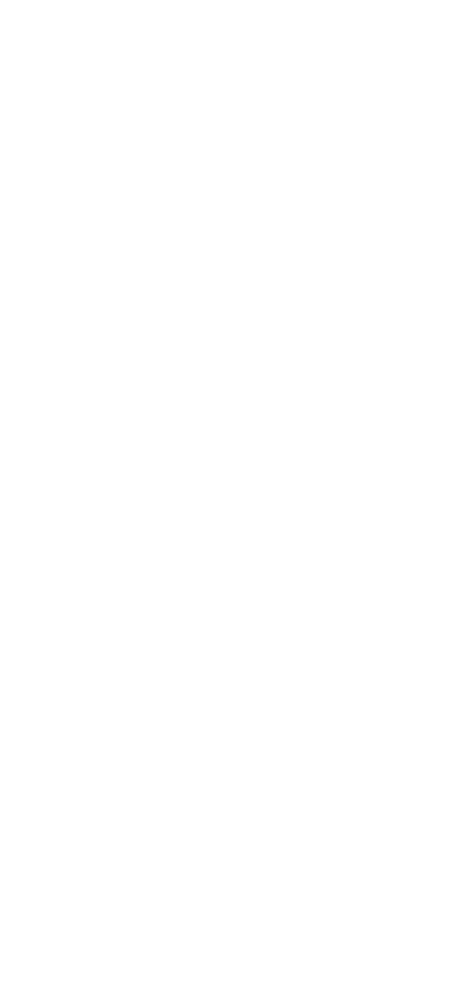
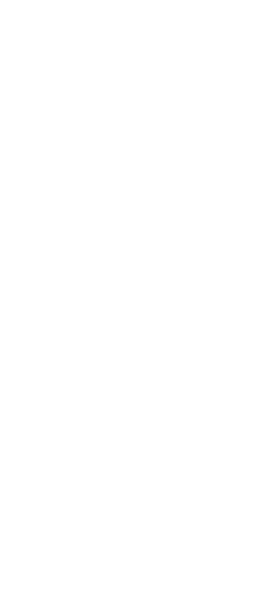
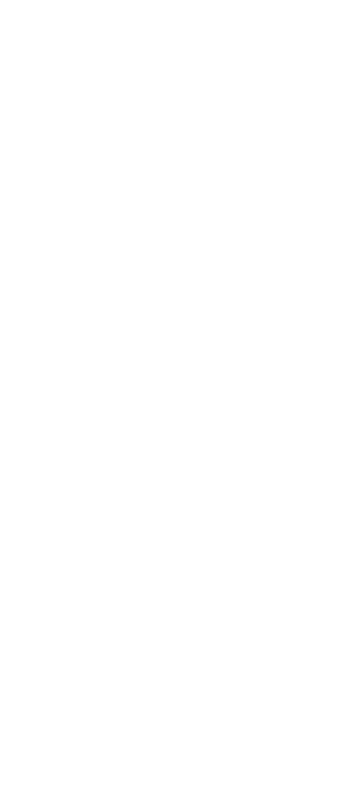
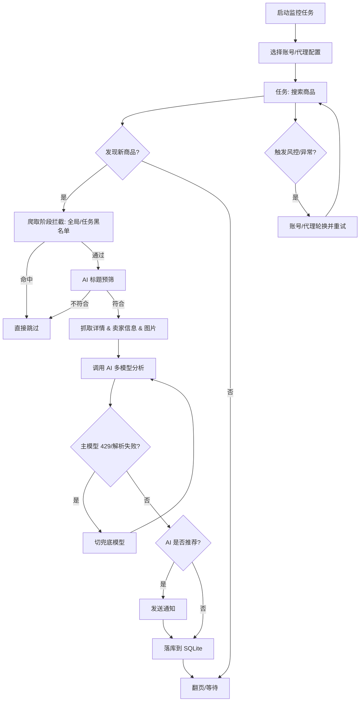

# 超级 AI 闲鱼监控器

[中文] ｜ [English](README_EN.md)

[](https://www.python.org/)
[](https://vuejs.org/)
[](https://fastapi.tiangolo.com/)
[](https://www.sqlite.org/)
[](LICENSE)

> 基于 Playwright + 多模态 AI 的闲鱼商品监控与智能筛选系统，多任务并发，Web 端全功能管理。

## 项目起源

本项目**不再是** [Usagi-org/ai-goofish-monitor](https://github.com/Usagi-org/ai-goofish-monitor) 的 fork，而是直接从上游 `git clone` 一份后作为独立仓库继续演进：SQLite 主存储、AI 调用稳健化、价格趋势分析、品牌视觉与文档全部独立维护。

上游项目仍保留 `upstream` 远程引用作为灵感来源，但所有变更都在本仓库完成与发布。

## 核心特性

- **Web 全功能管理**：任务、账号、AI 判断标准、运行日志、监控结果在浏览器内全部操作，无需命令行
- **多模态 AI 判断**：用自然语言描述购买需求即可生成分析标准，AI 结合商品图文、卖家信息综合判断
- **多任务并发**：每个任务独立配置关键词、价格区间、筛选条件、Prompt、账号与定时规则
- **两级黑名单（爬取阶段拦截）**：全局黑名单对所有任务生效，任务级黑名单只对单个任务生效；命中商品在爬取阶段即被丢弃，不再抓详情、不落库、不推送
- **多模型兜底**：AI 模型支持多个，第一个为主模型，其余为兜底；主模型 API/网络故障自动切到下一个，每个模型可单独测试连接
- **AI 调用稳健化**：429 立即切兜底模型；解析连续失败立即切兜底；服务不可用走超时（默认 60s）+ 熔断（默认 3 次失败熔断 5 分钟）；厂商特定思考参数自动注入
- **多渠道通知独立开关**：ntfy / 企业微信 / Bark / Telegram / 邮件(SMTP) / Webhook，每个渠道可单独启用
- **价格趋势与抄底机会**：监控概览直接展示「持续下跌可抄底」商品，按累计跌幅倒序排列，并在每张卡片内嵌入完整的价格走势曲线（均价 / 最低价曲线 + 最高 / 最低价标注），点击卡片直达商品页
- **结果智能排序与时间筛选**：AI 推荐商品优先展示，其余按价格升序；时间范围支持全部 / 一天内 / 三天内 / 七天内快速切换
- **账号与代理轮换**：多账号池自动切换，代理池轮换配合失败重试降低风控
- **批量修改任务**：对选中的多个任务一次性修改「通知推送 / 搜索页数 / 新发布范围」等字段，未修改项保持原值
- **中英双语界面**：右上角一键切换中文 / English，界面文案与提示完整本地化
- **定时调度总开关**：维护期一键暂停全部定时触发
- **Docker 一键部署**：内置 Chromium，开箱即用

## 截图

| 监控概览（持续下跌可抄底 + 各任务最新历史均价） | 任务管理 |
| --- | --- |
|  |  |

| 结果查看（市场快照 + 价格走势） | 系统设置（AI 模型） |
| --- | --- |
|  |  |

| 运行日志（按等级过滤） | 账号管理 |
| --- | --- |
|  |  |

完整长截图（监控概览整页）见 [`docs/screenshots/dashboard-overview.png`](docs/screenshots/dashboard-overview.png)。

## 快速开始

### 🐳 Docker 部署（推荐）

```bash
git clone https://github.com/LinBlink/super-ai-goofish-monitor.git
cd super-ai-goofish-monitor
cp .env.example .env
vim .env   # 填写 OPENAI_API_KEY / OPENAI_BASE_URL / OPENAI_MODEL_NAME 等必填项
docker compose up -d
docker compose logs -f app
```

- 默认 Web UI：`http://127.0.0.1:8000`
- 镜像内置 Chromium，无需宿主机再装浏览器
- 更新镜像：`docker compose pull && docker compose up -d`
- 修改了 `.env` 中的 `SERVER_PORT` 时，记得同步 `docker-compose.yaml` 的端口映射

持久化目录：

| 目录 | 用途 |
| --- | --- |
| `data/` | SQLite 主库（任务、结果、价格历史） |
| `state/` | 闲鱼账号登录态 JSON |
| `prompts/` | 任务 Prompt 文件 |
| `logs/` | 运行日志 |
| `images/` | 商品图片缓存（任务结束默认清理） |
| `config.json`、`jsonl/`、`price_history/` | 旧版数据源（首次升级时导入一次） |

### 本地源码运行

需要 Python 3.10+、Node.js（实测 `v20.18.3`）、Playwright CLI + Chromium：

```bash
git clone https://github.com/LinBlink/super-ai-goofish-monitor.git
cd super-ai-goofish-monitor
cp .env.example .env
chmod +x start.sh
./start.sh
```

`start.sh` 会先校验 Playwright/浏览器前置条件，再自动安装依赖、构建前端、复制构建产物并启动后端（监听 `http://localhost:8000`，API 文档 `http://localhost:8000/docs`）。

手动分步启动：

```bash
python -m src.app                       # 后端
cd web-ui && npm install && npm run dev # 前端开发服务器
# 或者生产构建：cd web-ui && npm run build（产物会复制到仓库根 dist/）
```

## 第一次使用

1. 打开 `http://127.0.0.1:8000`，用默认账号 `admin/admin123` 登录。
2. 进入「**账号管理**」，按 [Chrome 扩展](https://chromewebstore.google.com/detail/xianyu-login-state-extrac/eidlpfjiodpigmfcahkmlenhppfklcoa) 提示导出闲鱼登录态 JSON 并粘贴保存到 `state/acc_1.json`。
3. 进入「**任务管理** → 创建新任务」：
   - **AI 判断**：填写详细需求，后台异步生成分析标准，进度在独立弹窗中显示。
   - **关键词判断**：填写关键词规则，任务立即创建。
4. 在「**系统设置 → AI 模型**」填好 AI 配置并测试连接。
5. 在任务列表点击「启动」开始监控；命中商品会自动推送到已启用的通知渠道。

## 功能详解

<details>
<summary>监控概览（首页）</summary>

- **三块统计卡**：监测任务数、价格跟踪任务数、价格历史样本总量。
- **持续下跌可抄底**：扫描 30 天内所有商品快照，筛选「末 3 次价格严格递减且累计跌幅 ≥ 10%」的商品，按跌幅倒序展示。每张卡片内置完整 PriceTrendChart（均价、最低/最高价曲线，最高/最低价自动标注），点击卡片新窗口打开闲鱼商品页。
- **各任务最新历史均价**：每个任务的窗口期均价与每日价格走势曲线，点击进入该任务的结果页。
- **任务执行队列状态**：底部 system status 实时显示后端连接与运行中/排队的任务。

</details>

<details>
<summary>任务管理</summary>

- AI / 关键词两种判断模式，可独立绑定账号。
- 关键词规则支持「每行一个」和 `re:` 前缀正则（如 `re:\b(pm|pro[\s-]?max)\b`）。
- 价格范围、新发布范围、省/市/区三级地区筛选（区域数据来自闲鱼页面快照内置）。
- 定时规则：内置「每 5 分钟 / 每 15 分钟 / 每天 8:00 / 工作日 9:00 等」预设，也支持自定义 Cron（5 段 / 6 段 / `@daily` 等）。
- AI 标题预筛：默认开启，爬虫在抓详情页前先用 AI 判断标题是否根本不符合要求，不符合则跳过。

</details>

<details>
<summary>账号管理</summary>

- 多闲鱼账号登录态导入、查看、更新、删除。
- 每个任务可固定账号或交给系统自动选择；启用「账号轮换」后会在 `state/` 下的多个 `*.json` 之间自动切换。

</details>

<details>
<summary>结果查看</summary>

- 数据源为 SQLite（不再扫描 `jsonl` 文件）。
- 排序：爬取时间 / 发布时间 / 价格（升/降）/ 关键词命中数 / **智能排序**（AI 推荐优先 + 价格升序）。
- 时间范围快速切换：全部 / 一天内 / 三天内 / 七天内。
- 支持「仅看 AI 推荐」「仅看关键词推荐」「显示已屏蔽结果」三个开关。
- 支持导出 CSV、删除单条结果或整批结果文件。
- 顶部「价格走势洞察」面板使用与监控概览相同的 PriceTrendChart，展示均价 / 中位数 / 最低价曲线，并在最高、最低处做标注。

</details>

<details>
<summary>运行日志</summary>

- 按任务查看实时日志，WebSocket 推送，无需手动刷新。
- 日志等级过滤（DEBUG / INFO / WARNING / ERROR / CRITICAL）。
- 支持自动滚动、清空日志。

</details>

<details>
<summary>系统设置</summary>

- **AI 模型**：多模型配置 + 单独测试连接 + 主模型与兜底模型顺序调整。
- **IP 轮换**：账号轮换 + 代理池轮换的开关、模式、重试与冷却参数。
- **浏览器**：本地可切 Edge，Docker 内固定 Chromium。
- **定时调度**：总开关 `SCHEDULER_PAUSED`，维护期一键暂停。
- **全局黑名单**：跨任务生效，命中即在爬取阶段拦截（支持正则）。
- **通知推送**：ntfy / 企业微信 / Bark / Telegram / 邮件(SMTP) / Webhook，每个渠道独立开关 + 单独测试。
- **系统状态**：运行环境、`.env` 关键配置项、已加载通知渠道汇总。
- **Prompt 管理**：在线编辑 `prompts/` 下的 Prompt 文件并保存。

</details>

## 配置项速查

完整列表见 `.env.example`。最关键的几个：

| 变量 | 说明 | 必填 |
| --- | --- | --- |
| `OPENAI_API_KEY` | AI 模型 API Key | ✅ |
| `OPENAI_BASE_URL` | OpenAI 兼容接口地址 | ✅ |
| `OPENAI_MODEL_NAME` | 支持图片输入的模型名 | ✅ |
| `AI_MODELS` | 多模型 JSON 数组，覆盖单模型变量；第一个为主模型，其余为兜底 | ❌ |
| `AI_TITLE_SCREENING_ENABLED` | 全局关闭 AI 标题预筛（默认开启） | ❌ |
| `PROXY_URL` | AI 请求专用代理 | ❌ |
| `RUN_HEADLESS` | 爬虫无头模式，Docker 中保持 `true` | ❌ |
| `SERVER_PORT` | 后端监听端口，默认 `8000` | ❌ |
| `SCHEDULER_PAUSED` | 暂停全部定时触发（`true`/`false`） | ❌ |
| `WEB_USERNAME` / `WEB_PASSWORD` | Web UI 登录账号密码，默认 `admin/admin123` | ❌ |
| `*_ENABLED` | 各通知渠道独立开关（`NTFY_ENABLED` / `BARK_ENABLED` / ...） | ❌ |

## 架构概览



## 开发者

```bash
# 后端（任意一种）
python -m src.app
uvicorn src.app:app --host 0.0.0.0 --port 8000 --reload

# 前端
cd web-ui && npm install && npm run dev
cd web-ui && npm run build   # 产物写入仓库根 dist/
```

- FastAPI 启动时自动建库建表，首次启动尝试一次性从 `config.json / jsonl / price_history` 导入旧数据
- Vite 开发服务器把 `/api`、`/auth`、`/ws` 反代到 `http://127.0.0.1:8000`
- 测试与构建校验：

  ```bash
  PYTEST_DISABLE_PLUGIN_AUTOLOAD=1 pytest
  cd web-ui && npm run build
  ```

- 移动端截图：`web-ui/scripts/shoot.mjs` 用 Playwright 以 390×844 移动视口自动截取各页面到 `web-ui/docs/screenshots/`，默认访问 `http://localhost:4173`（`vite preview`），可用 `BASE_URL` 指向已运行的真实后端：

  ```bash
  cd web-ui && npm run build
  node web-ui/scripts/shoot.mjs                 # 截静态构建产物
  BASE_URL=http://127.0.0.1:8000 node web-ui/scripts/shoot.mjs   # 截带数据的真实后端
  ```

## 致谢

- 灵感来源：[Usagi-org/ai-goofish-monitor](https://github.com/Usagi-org/ai-goofish-monitor)
- 上游同时参考过：[superboyyy/xianyu_spider](https://github.com/superboyyy/xianyu_spider)
- 社区贡献：[@jooooody](https://linux.do/u/jooooody/summary) 与 [LinuxDo](https://linux.do/) 社区
- 工具：ClaudeCode / Gemini / Codex —— 体验 Vibe Coding 的快乐

## 注意事项

- 请遵守闲鱼用户协议与 `robots.txt` 规则，避免高频请求导致账号被限制
- 本项目仅供学习与个人使用，请勿用于商业用途或任何非法用途
- 本项目采用 [MIT 许可证](LICENSE) 发布，按「现状」提供，不提供任何形式的担保
- 详情见 [免责声明](DISCLAIMER.md)
