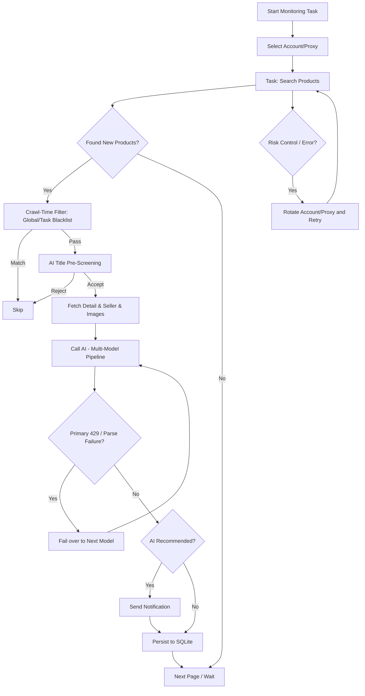

# Super AI Goofish Monitor

[中文](README.md) ｜ [English]

[](https://www.python.org/)
[](https://vuejs.org/)
[](https://fastapi.tiangolo.com/)
[](https://www.sqlite.org/)
[](LICENSE)

> A Playwright + multimodal-AI driven Goofish (Xianyu) monitor and smart-filtering platform with concurrent multi-task scheduling and a full-featured Web UI.

## Origins

This repository is **no longer a fork** of [Usagi-org/ai-goofish-monitor](https://github.com/Usagi-org/ai-goofish-monitor). It started as a direct `git clone` of the upstream and has since evolved into an independent project: SQLite primary storage, AI-call hardening, price-trend analytics, brand visual identity, and documentation are all maintained here.

The upstream remote is kept as a reference (`upstream`) but every change ships from this repository.

## Core Features

- **Full Web Management**: Tasks, accounts, AI criteria, run logs, results — everything in the browser, no CLI required.
- **Multimodal AI Judging**: Describe your requirement in natural language; the AI combines item text, images, and seller metadata to decide whether the listing is worth your attention.
- **Concurrent Multi-Task Scheduling**: Each task has its own keywords, price range, filters, prompt, account binding, and cron rule.
- **Two-Level Blacklist (Crawl-Time Interception)**: Global blacklist applies to every task; per-task blacklist applies to one task. Matches are dropped during the crawl itself — no detail fetch, no save, no notification.
- **Multi-Model AI Fallback**: Configure multiple models in `System Settings → AI Model`. The first is primary, the rest are fallbacks. On API/network errors the primary automatically fails over to the next; each model can be tested individually.
- **AI Call Hardening**: 429 → immediate failover to the next model; consecutive parse failures → immediate failover; service unreachable → per-call timeout (default 60s) + circuit breaker (default: 3 consecutive failures → 5-minute cooldown); vendor-specific "thinking-disable" parameters are auto-injected.
- **Per-Channel Notification Toggles**: ntfy / WeCom / Bark / Telegram / Email (SMTP) / Webhook — each can be enabled independently.
- **Price-Trend & Buy-the-Dip**: The dashboard surfaces "Persistent Drops — Buy-the-Dip Candidates" with total decline, current dip price, period high, and a full per-card price trend chart (average, min-price line, high/low markers). Click to open the listing directly.
- **Smart Result Sorting + Date Filter**: AI-recommended items float to the top; the rest are sorted by price ascending. A quick date filter (All / 1 day / 3 days / 7 days) sits next to it.
- **Account & Proxy Rotation**: Multi-account pool with automatic switching on failure; proxy pool rotation further lowers the risk of being rate-limited.
- **Batch Task Edit**: Update "notification push / search pages / fresh-listing window" for multiple selected tasks at once; unchanged fields keep their original values.
- **Bilingual UI**: Toggle Chinese / English from the top-right corner; all UI copy and hints are fully localized.
- **Scheduler Master Switch**: Pause all scheduled triggers from the system settings during maintenance windows.
- **Docker Deployment**: Built-in Chromium; one container, ready to run.

## Screenshots

| Dashboard (dip candidates + per-task historical avg) | Task Management |
| --- | --- |
|  |  |

| Results (market snapshot + price trend) | System Settings (AI Models) |
| --- | --- |
|  |  |

| Logs (level-filtered) | Account Management |
| --- | --- |
|  |  |

A full-page dashboard capture lives at [`docs/screenshots/dashboard-overview.png`](docs/screenshots/dashboard-overview.png).

## Quick Start

### 🐳 Docker (Recommended)

```bash
git clone https://github.com/LinBlink/super-ai-goofish-monitor.git
cd super-ai-goofish-monitor
cp .env.example .env
vim .env   # fill in OPENAI_API_KEY / OPENAI_BASE_URL / OPENAI_MODEL_NAME, etc.
docker compose up -d
docker compose logs -f app
```

- Default Web UI: `http://127.0.0.1:8000`
- The image bundles Chromium — no browser installation on the host
- Update image: `docker compose pull && docker compose up -d`
- If you change `SERVER_PORT` in `.env`, update the `ports` mapping in `docker-compose.yaml` as well

Persistent directories:

| Path | Purpose |
| --- | --- |
| `data/` | SQLite primary store (tasks, results, price history) |
| `state/` | Goofish account login-state JSON |
| `prompts/` | Task prompt files |
| `logs/` | Runtime logs |
| `images/` | Product image cache (cleaned after each task by default) |
| `config.json`, `jsonl/`, `price_history/` | Legacy data sources (imported once on first startup) |

### Run From Source

Requirements: Python 3.10+, Node.js (`v20.18.3` verified), Playwright CLI + Chromium:

```bash
git clone https://github.com/LinBlink/super-ai-goofish-monitor.git
cd super-ai-goofish-monitor
cp .env.example .env
chmod +x start.sh
./start.sh
```

`start.sh` first validates Playwright/Chromium prerequisites, then installs dependencies, builds the frontend, copies artifacts, and starts the backend at `http://localhost:8000` (API docs at `http://localhost:8000/docs`).

Manual split:

```bash
python -m src.app                              # backend
cd web-ui && npm install && npm run dev        # frontend dev server
# production build: cd web-ui && npm run build  (artifacts copied to repo-root dist/)
```

## First Run

1. Open `http://127.0.0.1:8000` and sign in with the default `admin / admin123`.
2. Open **Accounts**, follow the [Chrome Extension](https://chromewebstore.google.com/detail/xianyu-login-state-extrac/eidlpfjiodpigmfcahkmlenhppfklcoa) to export the Goofish login-state JSON, and paste it. The file is saved under `state/acc_1.json`.
3. Open **Tasks → Create Task**:
   - **AI mode**: enter the requirement description; a background job generates the criteria and a separate progress dialog shows its status.
   - **Keyword mode**: provide keyword rules; the task is created immediately.
4. Configure AI in **System Settings → AI Model** and click **Test Connection** for each model.
5. Hit **Start** on the task row; matching items flow into the enabled notification channels.

## Feature Tour

<details>
<summary>Dashboard</summary>

- **Three stat cards**: total monitored tasks, tasks with price history, cumulative price-history samples.
- **Persistent Drops — Buy-the-Dip Candidates**: scans every snapshot within a 30-day window, surfaces items whose last 3 prices are strictly decreasing **and** total decline ≥ 10%, ranked by decline magnitude. Each card embeds the same full PriceTrendChart used on the dashboard (average, min-price line, automatic high/low markers). Click to open the listing in a new tab.
- **Latest Historical Average Price by Task**: per-task windowed average with a daily price-trend chart. Click to open the task's results page.
- **System status**: realtime backend connection indicator at the bottom of the sidebar.

</details>

<details>
<summary>Task Management</summary>

- AI / keyword decision modes, optional account binding per task.
- Keyword rules support one-per-line and `re:`-prefixed regex (e.g. `re:\b(pm|pro[\s-]?max)\b`).
- Price range, new-listing window, province / city / district filter (region data is bundled from a Goofish page snapshot — no external calls).
- Cron scheduling with presets (every 5 min, every 15 min, daily 08:00, weekday 09:00, etc.) and a free-form 5-segment / 6-segment Cron input.
- AI Title Pre-Screening: enabled by default. Before fetching the detail page the crawler asks the AI whether the title fundamentally meets the criteria; non-matching items are skipped to save detail fetching, image downloads, and full AI analysis.

</details>

<details>
<summary>Account Management</summary>

- Import / view / update / delete Goofish login-state files.
- Each task can pin one account or let the system auto-select; enabling **Account Rotation** automatically switches between `*.json` files under `state/`.

</details>

<details>
<summary>Results</summary>

- Backed by SQLite (no more `jsonl` scanning).
- Sort by crawl time / publish time / price (asc/desc) / keyword-hit count / **Smart** (AI-picks-first, then price ascending).
- Date-range quick filter: All / 1 day / 3 days / 7 days.
- Filters: AI-only / keyword-only / include hidden.
- Export CSV, delete single items or the entire result file.
- Top **Price Trend Insight** panel uses the same full PriceTrendChart as the dashboard, rendering average / median / min-price lines with automatic high/low markers.

</details>

<details>
<summary>Logs</summary>

- Per-task log view with WebSocket push (no manual refresh).
- Level filter: DEBUG / INFO / WARNING / ERROR / CRITICAL.
- Auto-scroll and one-click clear.

</details>

<details>
<summary>System Settings</summary>

- **AI Model**: multi-model configuration, per-model test connection, drag-reorder primary/fallback.
- **Rotation**: account rotation + proxy pool rotation switches, modes, retry / cooldown parameters.
- **Browser**: toggle Edge vs. Chromium locally. Docker images always use Chromium.
- **Scheduler**: master switch `SCHEDULER_PAUSED`; pause everything during maintenance.
- **Global Blacklist**: cross-task crawl-time blacklist (regex supported).
- **Notifications**: per-channel toggle + per-channel test send for ntfy / WeCom / Bark / Telegram / Email (SMTP) / Webhook.
- **System Status**: runtime status, `.env` key sanity, loaded notification channels summary.
- **Prompt Management**: edit any file under `prompts/` and save.

</details>

## Configuration Cheat Sheet

Full list lives in `.env.example`. The most important keys:

| Variable | Description | Required |
| --- | --- | --- |
| `OPENAI_API_KEY` | AI model API key | ✅ |
| `OPENAI_BASE_URL` | OpenAI-compatible API base URL | ✅ |
| `OPENAI_MODEL_NAME` | Model name (must accept images) | ✅ |
| `AI_MODELS` | JSON array of models; overrides single-model vars. First element is primary, rest are fallbacks. | ❌ |
| `AI_TITLE_SCREENING_ENABLED` | Globally disable AI title pre-screening (on by default) | ❌ |
| `PROXY_URL` | Dedicated proxy for AI requests | ❌ |
| `RUN_HEADLESS` | Headless mode for the crawler — keep `true` in Docker | ❌ |
| `SERVER_PORT` | Backend port, default `8000` | ❌ |
| `SCHEDULER_PAUSED` | Pause every scheduled trigger (`true` / `false`) | ❌ |
| `WEB_USERNAME` / `WEB_PASSWORD` | Web UI credentials, default `admin/admin123` | ❌ |
| `*_ENABLED` | Per-channel notification switch (`NTFY_ENABLED`, `BARK_ENABLED`, ...) | ❌ |

## Architecture



## Development

```bash
# Backend (any one)
python -m src.app
uvicorn src.app:app --host 0.0.0.0 --port 8000 --reload

# Frontend
cd web-ui && npm install && npm run dev
cd web-ui && npm run build   # artifacts written to repo-root dist/
```

- FastAPI auto-initializes SQLite on startup; first boot also performs a one-time legacy import from `config.json / jsonl / price_history`.
- The Vite dev server proxies `/api`, `/auth`, and `/ws` to `http://127.0.0.1:8000`.
- Validation:

  ```bash
  PYTEST_DISABLE_PLUGIN_AUTOLOAD=1 pytest
  cd web-ui && npm run build
  ```

- Mobile screenshots: `web-ui/scripts/shoot.mjs` uses Playwright to capture every page at a 390×844 mobile viewport into `web-ui/docs/screenshots/`. It targets `http://localhost:4173` (`vite preview`) by default; point `BASE_URL` at a running real backend instead:

  ```bash
  cd web-ui && npm run build
  node web-ui/scripts/shoot.mjs                                   # static build
  BASE_URL=http://127.0.0.1:8000 node web-ui/scripts/shoot.mjs   # live backend with data
  ```

## Acknowledgments

- Inspiration: [Usagi-org/ai-goofish-monitor](https://github.com/Usagi-org/ai-goofish-monitor)
- Upstream also referenced: [superboyyy/xianyu_spider](https://github.com/superboyyy/xianyu_spider)
- Community contributions: [@jooooody](https://linux.do/u/jooooody/summary) and the [LinuxDo](https://linux.do/) community
- Tools: ClaudeCode / Gemini / Codex — for the joy of Vibe Coding

## Notices

- Please comply with Goofish's user agreement and `robots.txt`. Avoid aggressive request rates that could trigger account throttling.
- This project is for learning and personal use only. Do not use it for commercial or illegal purposes.
- Released under the [MIT License](LICENSE), provided "as is", without warranty of any kind.
- See [DISCLAIMER.md](DISCLAIMER.md) for the full disclaimer.
